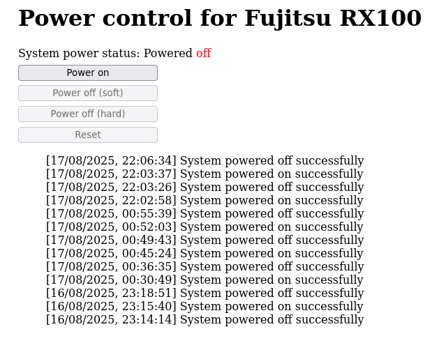

# web-power-control

This is a web application which presents both a web-based UI and a REST API for remotely controlling the power status of a computer.

It is tested on a Raspberry Pi Model 1B but should work on later models too.

## Installation

These steps assume you are setting up a Raspberry Pi for just this purpose.

1) Install the latest Raspberry Pi OS to an SD card
2) Install WiringPi
3) Install the Dancer2 and RPi::WiringPi Perl modules
4) Check out or download the repository to `/opt/web-power-control/`
5) Edit `config.yml` to suit your environment
6) Copy `web-power-control.service` to `/etc/systemd/system`
7) Run `systemctl daemon-reload`
8) Run `systemctl enable web-power-control.service`
9) Run `systemctl start web-power-control.service`

TODO: Photos and example of hardware.
